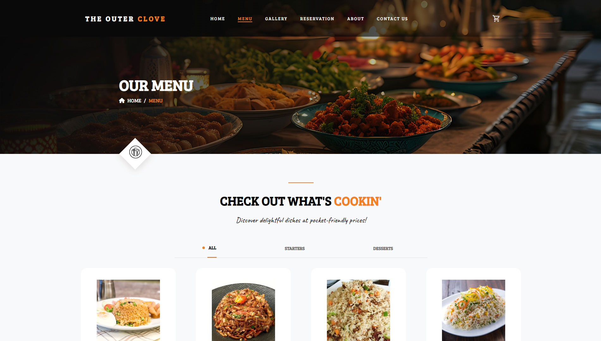
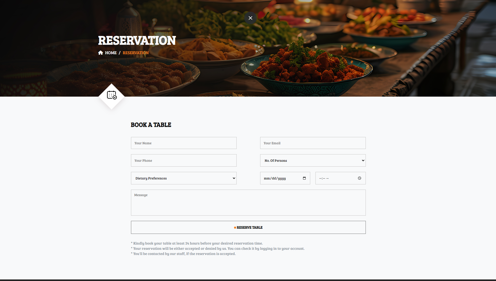
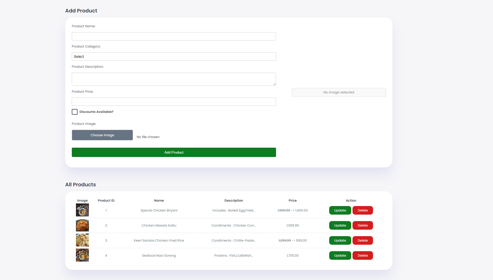
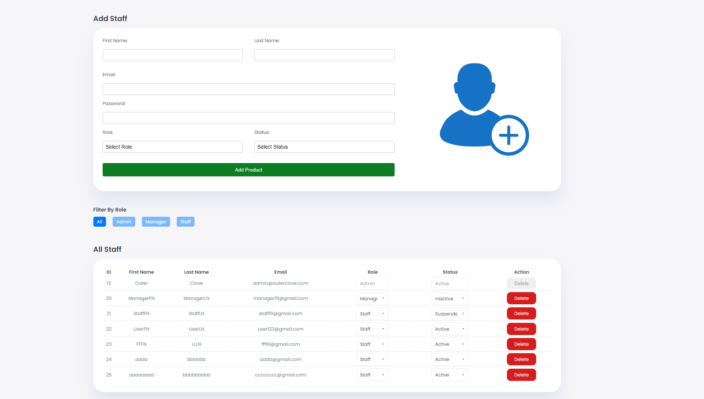
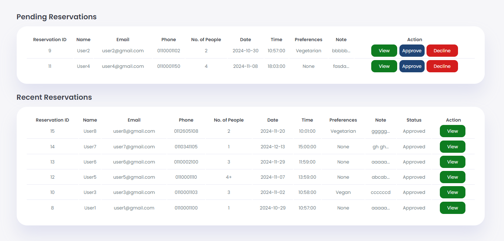

# Outer Clove Restaurant

This project is a dynamic restaurant website designed to showcase The Outer Clove’s offerings, seamlessly integrating modern web technologies to deliver a high-quality user experience.

---

## Table of Contents
- [Features](#features)
- [Getting Started](#getting-started)
- [Installation](#installation)
- [Payment Integration](#payment-integration)
- [Usage](#usage)
- [Preview](#preview)

## Features

- **User-Friendly Design**: Engaging and visually pleasing interface with sections like menu, offers, and 'About Us'.
- **Restaurant Menu**: Browse the food menu, with options for takeaway or delivery.
- **Shopping Cart & Checkout**: Users can add items to their cart and proceed through a streamlined checkout process.
- **Order Scheduling**: Options for immediate or scheduled pickup/delivery.
- **Reservations**: Users can reserve tables directly through the website.
- **Contact & Feedback**: A contact form for inquiries and feedback, allowing direct communication with users.
- **Admin Panel**: Separate dashboards for **Admin**, **Manager**, and **Staff** roles, offering various permissions and management capabilities:
  - **Reservation Management**: Accept, decline, and view reservations.
  - **Product Management**: Add, delete, and view products in the menu.
  - **Inquiries & Feedback**: View and respond to user inquiries and feedback.
  - **Staff Management**: Add and delete staff members, as well as assign or update roles and statuses.
- **Payment Gateway Integration**: PayPal integration for secure transactions.

## Getting Started

Follow these instructions to clone the project and running on your local machine.

### Prerequisites
- **Web Server**
- **PHP**
- **MySQL** for database

## Installation
1. **Clone the repository**:
   ```bash
   git clone https://github.com/IshanArdithya/TheOuterClove.git

2. **Move the Project**:
   
   If you're using XAMPP, move the project folder to the `htdocs` directory.

3. **Start Apache and MySQL**:

   In XAMPP, start Apache and MySQL so you can access the database.

4. **Set Up the Database**:

   Import the `outerclove.sql` file into your MySQL database.

5. **Configuration**:

   Update the `connectdb.php` file with your database connection details.

## Payment Integration

Follow these steps to configure **PayPal**:

1. Sign up for a PayPal Developer account.
2. Set up a sandbox account to test transactions.
3. Create `.env` file in the web folder.
4. Type `PAYPAL_CLIENT_ID=` and place your client ID. It should look like this: `PAYPAL_CLIENT_ID=YOURCLIENTID`.

## Usage

1. Access the website at `http://localhost/TheOuterClove` or your server’s URL.
2. Browse through the menu and interact with the cart.
3. Use the "Order Now" button to place orders.
4. Make payments via the PayPal integration (sandbox mode for testing).
5. Use the **Admin Panel** to manage reservations, products, feedback, and staff roles.

## Preview










